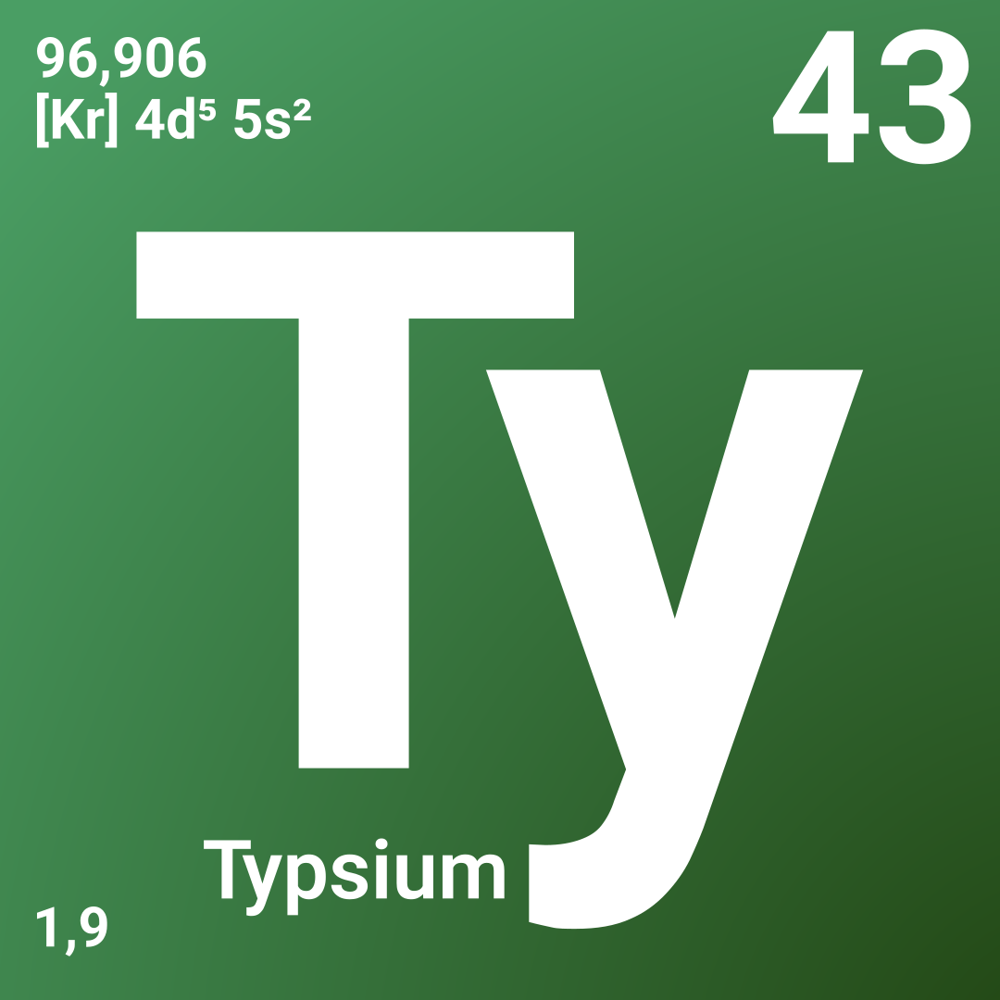

  <picture>
     
  </picture>

Typsium is a community-driven effort for creation and maintenance of amazing chemistry [Typst](https://typst.app/) packages.
The organization is run by volunteer Typst users and is unaffiliated with the official Typst project.

# 🧑‍🔬 Are you a chemist?
Let us know what you need! Get involved by reporting bugs, making feature requests or answering questions!
# 🧑‍💻 Are you a developer?
Everyone is welcome. Please get involved and contribute!

## 💬 Communication Channels
Discussion related to the Typsium Project as a whole mostly takes place in the [Discussion Board](https://github.com/orgs/typsium/discussions) otherwise use the package specific repositories. 
